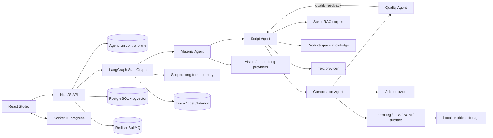
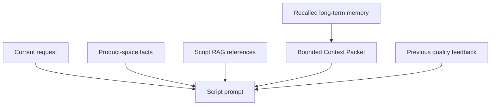

<p align="center">
  
</p>

<h1 align="center">VidForge</h1>

<p align="center"><strong>Open-Source-Multi-Agent-Infrastruktur für wissensbasierte Videogenerierung.</strong><br />
VidForge verbindet Medienverständnis, Markenwissen, Kontext-Engineering, Skriptplanung, Videogenerierung, Qualitätsfeedback und Medienkomposition zu einer beobachtbaren Pipeline.</p>

<p align="center">
  <a href="./README.md">English</a> · <a href="./README.zh-CN.md">简体中文</a> · <a href="./README.ja.md">日本語</a> · <a href="./README.fr.md">Français</a> · <a href="./README.de.md">Deutsch</a> · <a href="./README.ru.md">Русский</a>
</p>

<p align="center">
  <a href="https://github.com/WANGLEVY9/VidForge/actions/workflows/ci.yml"></a>
  <a href="https://github.com/WANGLEVY9/VidForge/actions/workflows/codeql.yml"></a>
  <a href="https://github.com/WANGLEVY9/VidForge/actions/workflows/secret-scan.yml"></a>
  <a href="./LICENSE"></a>
  
</p>

<p align="center"><a href="https://vid-forge-frontend-nu.vercel.app/">Demo</a> · <a href="./docs/AGENT_RUNTIME.md">Agent-Runtime</a> · <a href="./docs/TECHNICAL_ARCHITECTURE.md">Architektur</a> · <a href="./ROADMAP.md">Roadmap</a></p>

> **Status: aktive Entwicklung.** VidForge kann ohne kostenpflichtige Modellzugänge gebaut und getestet werden. Für echte Text-, Bild-, Video- und TTS-Generierung werden die jeweiligen Provider benötigt. Die öffentliche Demo ist ein unabhängiges Deployment und aktiviert möglicherweise nicht alle Provider.

## Was ist VidForge?

VidForge ist ein selbst hostbarer KI-Video-Workspace für Commerce und Produkt-Storytelling. Eine Anfrage wird nicht als einzelner Modellaufruf behandelt, sondern als zustandsbehafteter Workflow: Spezialisierte Agents suchen Assets, bauen begrenzten Kontext auf, planen ein Storyboard, rufen Medien-Provider auf, bewerten das Ergebnis und geben Qualitätsbelege an den nächsten Versuch zurück.

| Bereich                     | Implementierung                                                                                      |
| --------------------------- | ---------------------------------------------------------------------------------------------------- |
| Multi-Agent-Orchestrierung  | Expliziter LangGraph-State, spezialisierte Nodes, bedingte Neuplanung, begrenzte Retries und Abbruch |
| Wissensbasierte Generierung | Script-RAG, Produktbereich-Wissen, Mediensuche und nachvollziehbare Referenzen                       |
| Kontext-Engineering         | Bereichsbezogenes Langzeitgedächtnis, Retrieval-Scores, Prompt-Budgets, Bereinigung und Feedback     |
| Ausführbare Video-Pipeline  | Parallele Shot-Erzeugung, FFmpeg, TTS, Musik, Untertitel, Storage und Fortschritt                    |

## Multi-Agent-Runtime

```text
START → orchestrator → material_analysis → script_generation
                                      ↓                    ↓
                              quality_control ← video_composition
                                      │
                                      └── begrenzte Qualitäts-Neuplanung → script_generation
```

| Agent             | Aufgabe                                                                    | Ausgabe                                  |
| ----------------- | -------------------------------------------------------------------------- | ---------------------------------------- |
| Material Agent    | Sucht Bilder im Benutzer- und Produktbereich und sortiert deterministisch  | Bis zu fünf Medienkandidaten             |
| Script Agent      | Verbindet Anfrage, Medien, RAG, Memory und vorheriges Qualitätsfeedback    | Drei-Shot-Plan Hook / Demo / CTA         |
| Composition Agent | Erzeugt Shots in begrenzten parallelen Batches und pollt Provider-Aufgaben | Shot-Ergebnisse und finale Medien-URL    |
| Quality Agent     | Prüft Vollständigkeit, Dauer, Konsistenz, Compliance und Hook              | Fünf Dimensionen und Neuplanungsfeedback |

Das System verwendet einen expliziten Graphen statt eines unkontrollierten Agent-Swarms. Provider- und vorübergehende Netzwerkfehler erhalten begrenzte Retries mit exponentiellem Backoff und Jitter. Abbrüche, Eingabefehler und HTTP 4xx werden nicht wiederholt; Qualitäts-Neuplanung wird separat durch `AGENT_QC_MAX_RETRIES` begrenzt.

## Systemarchitektur



Der Graph-State enthält Anfrage, abgerufene Memory, Medienanalyse, Skriptplan, RAG-Belege, Kompositionsergebnis, Qualitätsdimensionen, Fehler und Trace-Zusammenfassungen. PostgreSQL speichert die Lauf-Kontrollebene und den Endzustand. `PostgresSaver` persistiert LangGraph-Supersteps; ein separater Agent Worker übernimmt abgelaufene Leases und setzt denselben Thread am letzten unvollständigen Node fort. Dies ist Recovery an Node-Grenzen, kein eventgesourcter Workflow-Engine-Ersatz und keine Exactly-once-Garantie für Provider-Aufrufe.

### Steuerung und Fehlersemantik

- Provider-, Datenbank- und temporäre Netzwerkfehler erhalten begrenzte Retries mit exponentiellem Backoff und Jitter.
- Abbrüche, Syntax-/Typfehler und HTTP-4xx-Eingabefehler werden nicht wiederholt.
- `agent_runs` speichert queued/running/terminal, Fortschritt, Eingabe und Ergebnis.
- Unterbrochene `running`-Aufgaben werden beim Start als failed markiert, um doppelte Provider-Kosten zu vermeiden.
- `AbortController` propagiert den Abbruch an die aktive Graph-Ausführung.

## Kontext-Engineering



Das Context Packet filtert schwache Treffer, sortiert deterministisch nach Score und ID, begrenzt Anzahl und Zeichen, entfernt Steuerzeichen und escaped markupsensible Inhalte. Memory-ID, Typ, Score und Provenienz bleiben erhalten; Memory wird als Referenzdaten und nicht als Modellanweisung markiert.

```dotenv
AGENT_MAX_RETRIES=3
AGENT_RETRY_BASE_DELAY_MS=2000
AGENT_QC_MAX_RETRIES=2
AGENT_MEMORY_TOP_K=6
AGENT_MEMORY_MAX_CHARS=1800
```

## Wissen, RAG, Kontext und Memory

Drei Wissensebenen werden getrennt gehalten:

- **Produktbereich-Wissen**: Verkaufsargumente, Zielgruppe, Markenton, Preispositionierung, verbotene Wörter und bis zu fünf hochwertige Skriptmuster. Nur nicht-fallback Runs mit Score mindestens 85 schreiben Best Practices idempotent zurück.
- **Script-RAG-Korpus**: Neun strukturierte Seeds in sieben Commerce-Kategorien. Jede Seed enthält Hook-Typ, Hook-/Demo-/CTA-Skelett, Nachrichtenbeispiele, Musikrichtung und Herkunftsmetadaten.
- **Mediensuche**: Benutzer-/Produktbereich-Isolation, Tags, Analysemetadaten, Captions und optionales 1024-dimensionales pgvector-Embedding. Der aktuelle Agent kombiniert SQL und deterministische Heuristiken; die semantische API ist die Erweiterungsstelle für Embedding-Provider.

Die Script-RAG-Suche ist deterministisch und reproduzierbar: Kategorie-Matches haben das höchste Gewicht, Stil-Matches ein sekundäres Gewicht, Teilmatches einen kleinen Bonus. Standardmäßig werden die zwei besten Seeds an den Prompt übergeben und in `ragReferences` dokumentiert. Das eingebaute Korpus ist eine Entwicklungsbasis, kein Conversion-Benchmark.

Das Langzeitgedächtnis `agent_memories` unterstützt die Scopes `user`, `product_space` und `run` sowie die Typen `preference`, `fact`, `success_pattern`, `failure_pattern` und `decision`.

```text
score = lexical_match × 0.65 + importance × 0.25 + recency × 0.10
```

Das Context Packet filtert schwache Treffer, begrenzt Anzahl und Zeichen, entfernt Steuerzeichen und kennzeichnet Memory als Referenzdaten statt als Anweisung. Memory-Fehler sind fail-soft und stoppen die Videogenerierung nicht.

## Qualitätsschleife und Medienpipeline

Quality Agent gewichtet Vollständigkeit mit 30 %, Dauer mit 15 %, Konsistenz mit 20 %, Compliance mit 20 % und Hook-Stärke mit 15 %. Ein gewichteter Score ab 70 ohne Compliance-Treffer gilt als erfolgreich; andernfalls geht strukturiertes Feedback für eine begrenzte Neuplanung an den Script Agent zurück.

Composition Agent erzeugt bis zu drei Shots parallel, pollt bis zu acht Minuten, normalisiert und verbindet sie mit FFmpeg, erzeugt Sprache oder eine Stille-Fallback, mischt Musik, erstellt SRT-Untertitel und veröffentlicht lokal oder in OSS. Das Ergebnis enthält Dauer, Größe, SHA-256 und Medienmerkmale. Ohne Video-Provider wird die fehlende Fähigkeit gemeldet, statt einen Placeholder als fertiges Ergebnis auszugeben.

Quality Agent bewertet Vollständigkeit mit 30 %, Dauer mit 15 %, Konsistenz mit 20 %, Compliance mit 20 % und Hook-Stärke mit 15 %. Ab 70 Punkten ohne Compliance-Treffer gilt ein Run als erfolgreich.

## Provider-Verträge

Externe Fähigkeiten liegen hinter fachlichen TypeScript-Verträgen und nicht hinter SDK-Request-Formen.

| Fähigkeit          | Vertrag                   | Aktueller Adapter                     |
| ------------------ | ------------------------- | ------------------------------------- |
| Textgenerierung    | `TextGenerationProvider`  | ARK text                              |
| Videogenerierung   | `VideoGenerationProvider` | ARK video                             |
| Text-to-Speech     | `TextToSpeechProvider`    | Volcano/OpenSpeech + Silence-Fallback |
| Objektspeicher     | `ObjectStorageProvider`   | Aliyun OSS + lokaler Fallback         |
| Medienverarbeitung | `MediaProcessingProvider` | FFmpeg                                |

Ein neuer Adapter muss den Business-Vertrag einhalten, seine Fähigkeit sichtbar machen und Trace-Metadaten bewahren, ohne vendor-spezifische Typen in Agents zu verbreiten.

## Provider, Queues und Observability

Text, Video, TTS, Objektspeicher und Medienverarbeitung sind durch fachliche TypeScript-Verträge getrennt. Aktuelle Adapter sind ARK, Volcano/OpenSpeech TTS, Aliyun OSS und FFmpeg. BullMQ verarbeitet Shot-Erzeugung, Komposition, Export und Medienanalyse; lokal kann Redis bei Ausfall auf einen Prozess-Fallback zurückfallen.

`trace_spans` erfasst Aufgabe, Scope, Latenz, Status, Modell, Tokens, geschätzte Kosten, Cache-Hit und Metadaten. Der Agent-Workflow erfasst zusätzlich Retries, Trace-Spans, Memory-Hits, den höchsten Memory-Score und RAG-Referenzen. Trace-Schreibfehler sind fail-soft.

Queue-Jobs unterstützen Attempts, Prioritäten, Verzögerungen und idempotente Job-IDs. ARK-Antworten verwenden Redis als Cross-Process-Cache und einen In-Memory-LRU-Fallback; OTLP-Export und Trace-Schreiben dürfen den kreativen Workflow nicht stoppen.

## Implementiert und Roadmap

Implementiert: Frontend-Workspace, Authentifizierung, Produktbereiche, Medien, Skripte, Aufgaben, Multi-Agent-Graph, Qualitäts-Neuplanung, Basis-RAG, bereichsbezogenes Memory, FFmpeg-Komposition, PostgreSQL-Checkpoints mit Node-Recovery, separater Agent Worker, Provider-Operations-Ledger und optionale Redis/BullMQ-Pfade.

Implementiert sind außerdem opt-in Human-in-the-Loop mit `interrupt()`/resume, redigierte Checkpoint-Inspektion, Replay/Fork über isolierte Threads, ein transaktionaler Agent-Outbox, getrennte Agent-/Media-Worker-Rollen und echte Business-Verarbeitung für Creation/Composition/Export. Roadmap bleiben Workflow-Versionierung, dynamischer Subagent-Router, berechtigungsbewusste Skills/Tools, hybrides RAG mit Reranker und Agent-Trajectory-Evaluation.

Design-Referenzen sind [LangGraph.js](https://github.com/langchain-ai/langgraphjs), [DeerFlow](https://github.com/bytedance/deer-flow), [Letta](https://github.com/letta-ai/letta) und [Claude Code Subagents](https://code.claude.com/docs/en/sub-agents). Daraus folgt weder Feature-Parität noch Code-Wiederverwendung.

### Fähigkeitsmatrix

| Fähigkeit                                           | Status                          | Externe Voraussetzung                           |
| --------------------------------------------------- | ------------------------------- | ----------------------------------------------- |
| Frontend-Studio und browser-only `/try`             | Implementiert                   | Keine für `/try`                                |
| Auth, Produktbereiche, Medien, Skripte und Aufgaben | Implementiert                   | PostgreSQL                                      |
| Multi-Agent-Graph und Qualitäts-Neuplanung          | Implementiert                   | Text-/Video-Provider für echte Ausgabe          |
| Script-RAG und Referenzweitergabe                   | Baseline implementiert          | Keine für integrierte Seeds                     |
| Bereichsbezogenes Memory und Context Packet         | Lexikale Baseline implementiert | PostgreSQL                                      |
| Semantische Mediensuche                             | Optionaler Pfad implementiert   | pgvector + Embedding-Endpunkt                   |
| FFmpeg-Komposition                                  | Implementiert                   | Lokales FFmpeg                                  |
| Dauerhafte Queue und Cross-Process-Cache            | Optionaler Pfad implementiert   | Redis                                           |
| PostgreSQL-Checkpoint und Node-Recovery             | Implementiert                   | PostgreSQL + separater Agent Worker             |
| Provider-Operations-Ledger und Owner-Audit          | Implementiert                   | PostgreSQL; Provider-Idempotenz adapterabhängig |
| Menschliche Freigabe / interrupt-resume             | Implementiert optional          | Checkpoint-Persistenz; Review-UI per API        |
| Agent-Outbox und isoliertes Replay/Fork             | Implementiert                   | PostgreSQL + Redis                              |
| Medien-Worker für Shot/Komposition/Export           | Implementiert                   | Redis, FFmpeg und konfigurierte Provider        |
| Dynamischer Router, Skills und Tool-Registry        | Roadmap                         | Runtime- und Berechtigungsmodell                |
| Hybrides RAG, Reranker und Evaluationsdatensatz     | Roadmap                         | Corpus und Evaluationsdesign                    |

### Agent-Roadmap

- **Dauerhafte Ausführung und menschliche Aufsicht**: `interrupt()`-Freigabeknoten, redigierte Inspektion, Replay/Fork und Agent-Outbox sind implementiert; Workflow-Versionierung bleibt offen.
- **Context Engineering**: Query Planning, Kompression, Evidence Gating und Token-Budget pro Node.
- **Hierarchisches Multi-Agent**: typisierter Router, Delegationsbudgets und isolierte State-Slices.
- **Memory-Lebenszyklus**: Konsolidierung, Widersprüche, Decay, Promotion zu Produktwissen und Retrieval-Metriken.
- **Skills und Tools**: auffindbare, berechtigte Fähigkeiten statt aller Aktionen im Prompt.
- **Agent-Evaluation**: Trajektorien, RAG-Belege, Memory-Nutzen, Provider-Kosten und Medienqualität getrennt messen.

## Schnellstart

Voraussetzungen: Node.js 20, pnpm `8.15.4`, Docker Compose und FFmpeg 4+.

```bash
git clone https://github.com/WANGLEVY9/VidForge.git
cd VidForge
corepack enable
corepack prepare pnpm@8.15.4 --activate
pnpm install --frozen-lockfile
docker compose up -d
cp apps/backend/.env.example apps/backend/.env
cp apps/frontend/.env.example apps/frontend/.env.local
pnpm --filter @vidforge/backend migration:run
pnpm check:env
pnpm dev
```

Frontend: `http://localhost:3000`, Erlebnisfluss `/try`, Workspace `/workspace`, API `http://localhost:3001/api`, Swagger `/api/docs`. Für echte Generierung sind Provider-Zugangsdaten erforderlich. Prüfungen: `pnpm docs:check`, `pnpm test`, `pnpm lint`, `pnpm build`, `pnpm verify`.

### Konfiguration und lokale Oberflächen

| Variable                            | Erforderlich   | Zweck                                           |
| ----------------------------------- | -------------- | ----------------------------------------------- |
| `DATABASE_URL`                      | Ja             | PostgreSQL-Verbindung                           |
| `JWT_SECRET`                        | Produktion     | Mindestens 32 Zeichen in Produktion             |
| `WEB_BASE_URL`                      | Produktion     | HTTP-/WebSocket-CORS-Allowlist                  |
| `API_BASE_URL`                      | Produktion     | Öffentlicher Medien-/Export-URL-Präfix          |
| `ARK_TEXT_PRIMARY_*`                | Optional       | Echte Text- und Quality-Model-Aufrufe           |
| `ARK_VIDEO_PRIMARY_*`               | Optional       | Echte Shot-Erzeugung                            |
| `EMBEDDING_API_URL`                 | Optional       | Medien-Embeddings, standardmäßig lokales Ollama |
| `REDIS_URL`                         | Lokal optional | BullMQ und Cross-Process-Cache                  |
| `VOLC_TTS_APPID` / `VOLC_TTS_TOKEN` | Optional       | Echtes TTS statt Silence-Fallback               |
| `OSS_*`                             | Optional       | Objektspeicher statt lokaler Platte             |
| `OTEL_EXPORTER_OTLP_*`              | Optional       | OTLP/HTTP-Trace-Collector                       |
| `VITE_API_BASE_URL`                 | Frontend       | Im Browser sichtbarer Backend-Origin            |
| `VITE_WS_URL`                       | Optional       | WebSocket-Origin-Override                       |

Keine Secrets in `VITE_*` ablegen: Vite bettet sie in Browser-Assets ein.

| Oberfläche             | Lokale URL                                                                                                        |
| ---------------------- | ----------------------------------------------------------------------------------------------------------------- |
| Landing Page           | [`http://localhost:3000`](http://localhost:3000)                                                                  |
| Geführter Browserfluss | [`http://localhost:3000/try`](http://localhost:3000/try)                                                          |
| Workspace              | [`http://localhost:3000/workspace`](http://localhost:3000/workspace)                                              |
| REST API               | [`http://localhost:3001/api`](http://localhost:3001/api)                                                          |
| Swagger                | [`http://localhost:3001/api/docs`](http://localhost:3001/api/docs)                                                |
| Liveness / Readiness   | [`/api/health`](http://localhost:3001/api/health) / [`/api/health/ready`](http://localhost:3001/api/health/ready) |

## API und Beiträge

Wichtige Endpunkte sind `POST /api/agent/run`, `GET /api/agent/status/:taskId`, `GET /api/agent/runs/:taskId/audit`, `POST /api/agent/cancel/:taskId`, `GET /api/agent/memory`, `GET /api/spaces` und `PATCH /api/material/:id/analyze`. Swagger ist die maßgebliche Referenz für Request und Response.

Beiträge zu Provider-Adaptern, RAG-Evaluation, Memory-Konsolidierung, Checkpoints, menschlicher Freigabe, Videoqualität, Untertiteln, Audio, Accessibility und Deployment-Zuverlässigkeit sind willkommen. Bitte zuerst [`CONTRIBUTING.md`](./CONTRIBUTING.md), [`docs/CONTRIBUTOR_QUICKSTART.md`](./docs/CONTRIBUTOR_QUICKSTART.md) und [`GOVERNANCE.md`](./GOVERNANCE.md) lesen.

Keine API-Keys, JWT-Secrets, Datenbankzugänge oder Nutzerdaten committen. VidForge steht unter der [MIT License](./LICENSE) und ist unabhängig von den genannten Projekten und Unternehmen.

Die vollständige technische Dokumentation steht in [`README.md`](./README.md).

## Repository-Struktur

```text
apps/frontend/src/              # React/Vite-Studio, Seiten, Komponenten, Store, Clients
apps/backend/src/modules/agent/ # Graph, Agents, Runs, Memory, Context Packet
apps/backend/src/modules/rag/   # strukturiertes Script-RAG-Korpus
apps/backend/src/modules/media/ # FFmpeg, TTS, Musik, Untertitel, Storage
apps/backend/src/providers/     # Provider-Verträge und Adapter
docs/                           # Architektur, Runtime, Deployment, Observability
examples/                       # Fixtures ohne Zugangsdaten
scripts/                        # Repository- und Dokumentationsprüfungen
```

## Verifikation und Dokumentation

```bash
pnpm docs:check
pnpm check:hygiene
pnpm test:repo
pnpm test:backend
pnpm lint
pnpm stylelint
pnpm build
pnpm verify
```

CI prüft Unit-, Contract-, Migration-, Security-Policy- und FFmpeg-Smoke-Tests sowie Markdown-Links, Dependencies, Lint, Styles, Build und Bundle-Budgets.

| Dokument                                                             | Schwerpunkt                                          |
| -------------------------------------------------------------------- | ---------------------------------------------------- |
| [`docs/AGENT_RUNTIME.md`](./docs/AGENT_RUNTIME.md)                   | Graph-Lifecycle, Retries, Memory und Context-Budgets |
| [`docs/TECHNICAL_ARCHITECTURE.md`](./docs/TECHNICAL_ARCHITECTURE.md) | Systemgrenzen und Technologieentscheidungen          |
| [`docs/OBSERVABILITY.md`](./docs/OBSERVABILITY.md)                   | Trace, Kosten, Latenz und OTLP                       |
| [`docs/PROVIDER_CONTRACTS.md`](./docs/PROVIDER_CONTRACTS.md)         | Provider-Ersatzverträge                              |
| [`ROADMAP.md`](./ROADMAP.md)                                         | Projektentwicklung                                   |
| [`CHANGELOG.md`](./CHANGELOG.md)                                     | Versionshistorie                                     |
