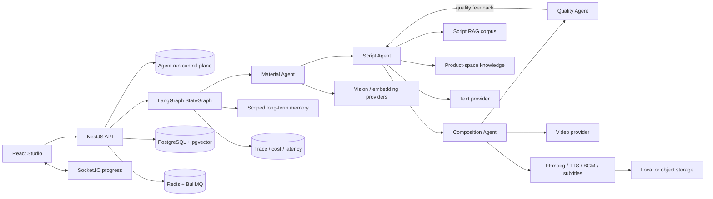
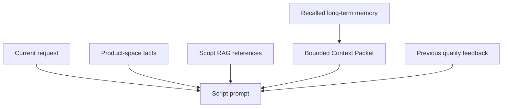

<p align="center">
  
</p>

<h1 align="center">VidForge</h1>

<p align="center"><strong>Une infrastructure open source Multi-Agent pour la génération vidéo fondée sur les connaissances.</strong><br />
VidForge relie compréhension des médias, connaissances de marque, ingénierie du contexte, planification de scripts, génération vidéo, contrôle qualité et assemblage média.</p>

<p align="center">
  <a href="./README.md">English</a> · <a href="./README.zh-CN.md">简体中文</a> · <a href="./README.ja.md">日本語</a> · <a href="./README.fr.md">Français</a> · <a href="./README.de.md">Deutsch</a> · <a href="./README.ru.md">Русский</a>
</p>

<p align="center">
  <a href="https://github.com/WANGLEVY9/VidForge/actions/workflows/ci.yml"></a>
  <a href="https://github.com/WANGLEVY9/VidForge/actions/workflows/codeql.yml"></a>
  <a href="https://github.com/WANGLEVY9/VidForge/actions/workflows/secret-scan.yml"></a>
  <a href="./LICENSE"></a>
  
</p>

<p align="center"><a href="https://vid-forge-frontend-nu.vercel.app/">Démo</a> · <a href="./docs/AGENT_RUNTIME.md">Runtime Agent</a> · <a href="./docs/TECHNICAL_ARCHITECTURE.md">Architecture</a> · <a href="./ROADMAP.md">Feuille de route</a></p>

> **Statut : développement actif.** VidForge peut être compilé et testé sans identifiants de modèles payants. La génération réelle de texte, d’images, de vidéos et de voix nécessite les Providers correspondants. La démo publique est un déploiement indépendant et peut ne pas activer tous les Providers.

## Qu’est-ce que VidForge ?

VidForge est un espace de production vidéo IA auto-hébergeable destiné au commerce et au storytelling produit. Une demande devient un workflow avec état : des Agents spécialisés recherchent des assets, construisent un contexte borné, planifient un storyboard, appellent les Providers média, évaluent le résultat et réinjectent les preuves de qualité dans l’essai suivant.

| Préoccupation                           | Implémentation                                                                                          |
| --------------------------------------- | ------------------------------------------------------------------------------------------------------- |
| Orchestration Multi-Agent               | État LangGraph explicite, nœuds spécialisés, replanification conditionnelle, retries bornés, annulation |
| Génération fondée sur les connaissances | Script RAG, connaissances d’espace produit, recherche média et références traçables                     |
| Ingénierie du contexte                  | Mémoire long terme par scope, scores de recherche, budget de prompt, nettoyage et feedback              |
| Pipeline vidéo exécutable               | Génération parallèle de plans, FFmpeg, TTS, musique, sous-titres, stockage et progression               |

## Runtime Multi-Agent

```text
START → orchestrator → material_analysis → script_generation
                                      ↓                    ↓
                              quality_control ← video_composition
                                      │
                                      └── replanification qualité bornée → script_generation
```

| Agent             | Responsabilité                                                                    | Sortie                                |
| ----------------- | --------------------------------------------------------------------------------- | ------------------------------------- |
| Material Agent    | Recherche des images dans l’espace utilisateur/produit et classement déterministe | Jusqu’à 5 candidats média             |
| Script Agent      | Fusion de la demande, des médias, du RAG, de la mémoire et du feedback précédent  | Plan Hook / Demo / CTA en trois plans |
| Composition Agent | Génération par lots parallèles bornés et polling des tâches Provider              | Résultats des plans et URL finale     |
| Quality Agent     | Évaluation de la complétude, durée, cohérence, conformité et Hook                 | Score à cinq dimensions et feedback   |

Le système utilise un graphe explicite, pas un essaim d’Agents non contrôlé. Les erreurs Provider et réseau transitoires utilisent un retry borné avec backoff exponentiel et jitter. Les annulations, erreurs d’entrée et HTTP 4xx ne sont pas retentés ; la replanification qualité possède sa propre limite `AGENT_QC_MAX_RETRIES`.

## Architecture système



L’état du graphe porte la demande, la mémoire récupérée, l’analyse des médias, le plan de script, les preuves RAG, le résultat de composition, les dimensions de qualité, les erreurs et les résumés de trace. PostgreSQL conserve le plan de contrôle de l’exécution et l’état final. `PostgresSaver` persiste les super-steps LangGraph ; un Agent Worker séparé récupère un lease expiré et reprend le même thread au dernier nœud inachevé. Il s’agit d’une reprise à la frontière d’un nœud, pas d’un moteur event-sourced ni d’une garantie exactly-once auprès des Providers.

### Contrôle et échecs

- Les erreurs Provider, base de données et réseau transitoire utilisent un retry LangGraph borné avec backoff exponentiel et jitter.
- Les annulations, erreurs de syntaxe/type et erreurs d’entrée HTTP 4xx ne sont pas retentées.
- `agent_runs` conserve les états queued/running/terminal, la progression, l’entrée et le résultat.
- Les tâches `running` interrompues sont marquées failed au démarrage afin d’éviter une double facturation Provider.
- `AbortController` propage l’annulation à l’invocation du graphe actif.

## Ingénierie du contexte



Le Context Packet filtre les résultats faibles, trie de façon déterministe par score et ID, impose des budgets de quantité et de caractères, supprime les caractères de contrôle et échappe les contenus sensibles. Les métadonnées d’ID, type, score et provenance sont conservées ; la mémoire est présentée comme donnée de référence, jamais comme instruction.

```dotenv
AGENT_MAX_RETRIES=3
AGENT_RETRY_BASE_DELAY_MS=2000
AGENT_QC_MAX_RETRIES=2
AGENT_MEMORY_TOP_K=6
AGENT_MEMORY_MAX_CHARS=1800
```

## Connaissances, RAG et mémoire

Trois plans de connaissances sont séparés :

- **Espace produit** : arguments de vente, audience, ton de marque, positionnement prix, mots interdits et jusqu’à cinq modèles de scripts de qualité. Seuls les runs non-fallback avec un score d’au moins 85 alimentent les bonnes pratiques de façon idempotente.
- **Corpus Script RAG** : 9 seeds structurées couvrant 7 catégories commerciales. Chaque seed contient un type de Hook, un squelette Hook / Demo / CTA, des exemples de messages, une direction musicale et des métadonnées de provenance.
- **Recherche média** : isolation utilisateur/espace produit, tags, métadonnées d’analyse, légendes et embedding pgvector optionnel de 1024 dimensions. L’Agent actuel combine SQL et heuristiques déterministes ; l’API sémantique fournit un point d’extension pour un Provider d’embeddings.

La recherche Script RAG est déterministe et reproductible : la correspondance de catégorie domine, le style apporte un score secondaire, les correspondances partielles un bonus réduit. Les deux meilleures seeds sont transmises au prompt et leurs identifiants restent dans `ragReferences`. Le corpus intégré est une base de développement, pas un benchmark de conversion.

## Boucle qualité et contrats Provider

| Dimension     | Poids | Signal                                                                    |
| ------------- | ----: | ------------------------------------------------------------------------- |
| Complétude    |  30 % | Plans générés avec succès par rapport au plan                             |
| Durée         |  15 % | Respect de la cible de 8 à 20 secondes                                    |
| Cohérence     |  20 % | Alignement description visuelle / voix-off, éventuellement évalué par LLM |
| Conformité    |  20 % | Mots interdits et expressions à risque en local                           |
| Force du Hook |  15 % | Qualité du mécanisme d’attention initial                                  |

Un run réussit lorsque le score pondéré atteint 70 sans terme de conformité. Les capacités externes sont isolées derrière des contrats métier TypeScript :

| Capacité            | Contrat                   | Adaptateur actuel                     |
| ------------------- | ------------------------- | ------------------------------------- |
| Génération de texte | `TextGenerationProvider`  | ARK text                              |
| Génération vidéo    | `VideoGenerationProvider` | ARK video                             |
| Synthèse vocale     | `TextToSpeechProvider`    | Volcano/OpenSpeech + silence fallback |
| Stockage objet      | `ObjectStorageProvider`   | Aliyun OSS + fallback local           |
| Traitement média    | `MediaProcessingProvider` | FFmpeg                                |

Un nouvel adaptateur doit respecter le contrat métier, exposer sa capacité et conserver les métadonnées de trace, sans propager les types SDK dans les Agents.

La mémoire long terme `agent_memories` accepte les scopes `user`, `product_space` et `run`, ainsi que les types `preference`, `fact`, `success_pattern`, `failure_pattern` et `decision`.

```text
score = lexical_match × 0.65 + importance × 0.25 + recency × 0.10
```

Le Context Packet filtre les résultats faibles, impose des budgets de quantité et de caractères, supprime les caractères de contrôle et présente la mémoire comme donnée de référence, jamais comme instruction. Les erreurs de mémoire sont fail-soft et ne bloquent pas la génération.

## Boucle qualité et pipeline média

Quality Agent pondère la complétude à 30 %, la durée à 15 %, la cohérence à 20 %, la conformité à 20 % et la force du Hook à 15 %. Un score pondéré d’au moins 70 sans terme de conformité déclenche la réussite ; sinon le feedback structuré revient au Script Agent pour une replanification bornée.

Composition Agent génère jusqu’à trois plans en parallèle, les interroge pendant huit minutes, normalise et concatène avec FFmpeg, produit une voix ou un silence de secours, mélange la musique, génère les sous-titres SRT et publie vers le stockage local ou OSS. Le résultat expose durée, taille, SHA-256 et caractéristiques média. Sans Provider vidéo, le système signale la capacité manquante au lieu de présenter un placeholder comme produit fini.

## Providers, files et observabilité

Les capacités texte, vidéo, TTS, stockage objet et traitement média sont isolées par des contrats TypeScript métier. Les adaptateurs actuels couvrent ARK, Volcano/OpenSpeech TTS, Aliyun OSS et FFmpeg. BullMQ gère les plans, la composition, l’export et l’analyse ; Redis indisponible peut utiliser un fallback en mémoire en développement.

`trace_spans` enregistre tâche, scope, latence, état, modèle, tokens, coût estimé, cache et métadonnées. Le workflow ajoute les retries, spans, hits mémoire, score mémoire maximal et références RAG. Les écritures de trace sont fail-soft.

Les jobs BullMQ supportent attempts, priorités, délais et identifiants idempotents. Le cache de réponses ARK utilise Redis entre processus et un LRU mémoire en fallback ; l’export OTLP ne doit pas interrompre le workflow créatif.

## Implémenté et feuille de route

Implémenté : workspace frontend, authentification, espaces produit, médias, scripts, tâches, graphe Multi-Agent, replanification qualité, RAG de base, mémoire scopée, composition FFmpeg, checkpoints PostgreSQL avec reprise de nœud, Agent Worker séparé, ledger d’opérations Provider et chemins Redis/BullMQ optionnels.

Sont également implémentés : HITL optionnel avec `interrupt()`/resume, inspection de checkpoint redigée, replay/fork sur des threads isolés, outbox transactionnelle Agent, rôles séparés Agent/Media Worker et exécution métier réelle des queues création/composition/export. Restent dans la feuille de route : versioning du workflow, routeur de subagents, registre skills/tools, RAG hybride avec reranker et évaluation des trajectoires Agent.

Références de conception : [LangGraph.js](https://github.com/langchain-ai/langgraphjs), [DeerFlow](https://github.com/bytedance/deer-flow), [Letta](https://github.com/letta-ai/letta) et [Claude Code subagents](https://code.claude.com/docs/en/sub-agents). Ces liens n’impliquent ni parité fonctionnelle ni réutilisation de code.

### Matrice des capacités

| Capacité                                       | Statut                        | Exigence externe                                            |
| ---------------------------------------------- | ----------------------------- | ----------------------------------------------------------- |
| Studio frontend et parcours `/try`             | Implémenté                    | Aucune pour `/try`                                          |
| Auth, espaces produit, médias, scripts, tâches | Implémenté                    | PostgreSQL                                                  |
| Graphe Multi-Agent et replanification qualité  | Implémenté                    | Provider texte/vidéo pour une sortie réelle                 |
| Script RAG et propagation des références       | Baseline implémentée          | Aucune pour le corpus intégré                               |
| Mémoire scopée et Context Packet               | Baseline lexicale implémentée | PostgreSQL                                                  |
| Recherche média sémantique                     | Chemin optionnel implémenté   | pgvector + endpoint embedding                               |
| Composition FFmpeg                             | Implémenté                    | FFmpeg local                                                |
| Queue durable et cache inter-processus         | Chemin optionnel implémenté   | Redis                                                       |
| Checkpoint PostgreSQL et reprise de nœud       | Implémenté                    | PostgreSQL + Agent Worker séparé                            |
| Ledger Provider et audit du propriétaire       | Implémenté                    | PostgreSQL; idempotence Provider dépendante de l’adaptateur |
| Approbation humaine / interrupt-resume         | Implémenté optionnel          | Checkpoint persistant ; UI via API                          |
| Outbox Agent et replay/fork isolé              | Implémenté                    | PostgreSQL + Redis                                          |
| Workers média shot/composition/export          | Implémenté                    | Redis, FFmpeg et Providers configurés                       |
| Routeur dynamique, skills et registry tools    | Feuille de route              | Modèle runtime et permissions                               |
| RAG hybride, reranker et dataset d’évaluation  | Feuille de route              | Corpus et protocole d’évaluation                            |

### Feuille de route Agent

- **Exécution durable et supervision humaine** : les nœuds `interrupt()`, l’inspection redigée, replay/fork et l’outbox Agent sont implémentés ; le versioning du workflow reste ouvert.
- **Context engineering** : query planning, compression, evidence gating et budget Token par nœud.
- **Multi-Agent hiérarchique** : routeur typé, budgets de délégation et slices d’état isolés.
- **Cycle de vie mémoire** : consolidation, contradictions, decay, promotion vers la connaissance produit et métriques de retrieval.
- **Skills et outils** : capacités découvrables et autorisées séparées des prompts.
- **Évaluation Agent** : trajectoires, preuves RAG, utilité mémoire, coût Provider et qualité média évalués séparément.

## Démarrage rapide

Prérequis : Node.js 20, pnpm `8.15.4`, Docker Compose et FFmpeg 4+.

```bash
git clone https://github.com/WANGLEVY9/VidForge.git
cd VidForge
corepack enable
corepack prepare pnpm@8.15.4 --activate
pnpm install --frozen-lockfile
docker compose up -d
cp apps/backend/.env.example apps/backend/.env
cp apps/frontend/.env.example apps/frontend/.env.local
pnpm --filter @vidforge/backend migration:run
pnpm check:env
pnpm dev
```

Frontend : `http://localhost:3000`, parcours `/try`, workspace `/workspace`, API `http://localhost:3001/api`, Swagger `/api/docs`. Les vrais Providers sont nécessaires pour générer des médias. Vérifications : `pnpm docs:check`, `pnpm test`, `pnpm lint`, `pnpm build`, `pnpm verify`.

### Configuration et surfaces locales

| Variable                            | Requise                | Usage                                     |
| ----------------------------------- | ---------------------- | ----------------------------------------- |
| `DATABASE_URL`                      | Oui                    | Connexion PostgreSQL                      |
| `JWT_SECRET`                        | Production             | Au moins 32 caractères en production      |
| `WEB_BASE_URL`                      | Production             | Allowlist CORS HTTP/WebSocket             |
| `API_BASE_URL`                      | Production             | Préfixe des URLs média/export publiques   |
| `ARK_TEXT_PRIMARY_*`                | Optionnelle            | Appels texte et quality model réels       |
| `ARK_VIDEO_PRIMARY_*`               | Optionnelle            | Génération réelle des plans               |
| `EMBEDDING_API_URL`                 | Optionnelle            | Embeddings média, Ollama local par défaut |
| `REDIS_URL`                         | Optionnelle localement | BullMQ et cache inter-processus           |
| `VOLC_TTS_APPID` / `VOLC_TTS_TOKEN` | Optionnelle            | TTS réel au lieu du silence fallback      |
| `OSS_*`                             | Optionnelle            | Stockage objet au lieu du disque local    |
| `OTEL_EXPORTER_OTLP_*`              | Optionnelle            | Collecteur OTLP/HTTP                      |
| `VITE_API_BASE_URL`                 | Frontend               | Origine backend visible du navigateur     |
| `VITE_WS_URL`                       | Optionnelle            | Override de l’origine WebSocket           |

Ne mettez jamais de secrets dans `VITE_*` : Vite les intègre aux assets du navigateur.

| Surface              | URL locale                                                                                                        |
| -------------------- | ----------------------------------------------------------------------------------------------------------------- |
| Landing page         | [`http://localhost:3000`](http://localhost:3000)                                                                  |
| Parcours guidé       | [`http://localhost:3000/try`](http://localhost:3000/try)                                                          |
| Workspace            | [`http://localhost:3000/workspace`](http://localhost:3000/workspace)                                              |
| API REST             | [`http://localhost:3001/api`](http://localhost:3001/api)                                                          |
| Swagger              | [`http://localhost:3001/api/docs`](http://localhost:3001/api/docs)                                                |
| Liveness / readiness | [`/api/health`](http://localhost:3001/api/health) / [`/api/health/ready`](http://localhost:3001/api/health/ready) |

## API et contribution

Endpoints représentatifs : `POST /api/agent/run`, `GET /api/agent/status/:taskId`, `GET /api/agent/runs/:taskId/audit`, `POST /api/agent/cancel/:taskId`, `GET /api/agent/memory`, `GET /api/spaces`, `PATCH /api/material/:id/analyze`. Swagger fait foi pour les requêtes et réponses.

Les contributions sur les adaptateurs Provider, l’évaluation RAG, la consolidation mémoire, les checkpoints, l’approbation humaine, la qualité vidéo, l’accessibilité et la fiabilité du déploiement sont les bienvenues. Consultez [`CONTRIBUTING.md`](./CONTRIBUTING.md), [`docs/CONTRIBUTOR_QUICKSTART.md`](./docs/CONTRIBUTOR_QUICKSTART.md) et [`GOVERNANCE.md`](./GOVERNANCE.md).

## Carte du dépôt

```text
apps/frontend/src/              # studio React/Vite, pages, composants, store, clients
apps/backend/src/modules/agent/ # graphe, Agents, runs, mémoire, Context Packet
apps/backend/src/modules/rag/   # corpus Script RAG structuré
apps/backend/src/modules/media/ # FFmpeg, TTS, musique, sous-titres, stockage
apps/backend/src/providers/     # contrats et adaptateurs Provider
docs/                           # architecture, runtime, déploiement, observabilité
examples/                       # fixtures sans identifiants
scripts/                        # contrôles du dépôt et de la documentation
```

## Vérification et documentation

```bash
pnpm docs:check
pnpm check:hygiene
pnpm test:repo
pnpm test:backend
pnpm lint
pnpm stylelint
pnpm build
pnpm verify
```

La CI vérifie les tests unitaires, contrats, migrations, politiques de sécurité, smoke FFmpeg, liens Markdown, dépendances, lint, styles, build et budget des bundles.

| Document                                                             | Objet                                                  |
| -------------------------------------------------------------------- | ------------------------------------------------------ |
| [`docs/AGENT_RUNTIME.md`](./docs/AGENT_RUNTIME.md)                   | cycle du graphe, retries, mémoire, budgets de contexte |
| [`docs/TECHNICAL_ARCHITECTURE.md`](./docs/TECHNICAL_ARCHITECTURE.md) | frontières et décisions techniques                     |
| [`docs/OBSERVABILITY.md`](./docs/OBSERVABILITY.md)                   | trace, coût, latence, OTLP                             |
| [`docs/PROVIDER_CONTRACTS.md`](./docs/PROVIDER_CONTRACTS.md)         | contrats de remplacement Provider                      |
| [`ROADMAP.md`](./ROADMAP.md)                                         | direction du projet                                    |
| [`CHANGELOG.md`](./CHANGELOG.md)                                     | historique des versions                                |

Ne commitez jamais de clés API, secrets JWT, identifiants de base de données ou données utilisateur. VidForge est distribué sous [MIT License](./LICENSE) et reste indépendant des projets et entreprises cités.

Pour la documentation technique complète, consultez [`README.md`](./README.md).
