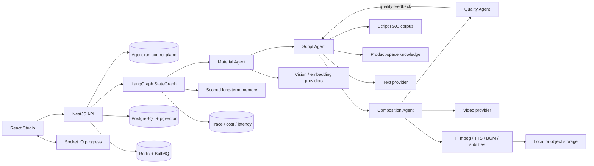
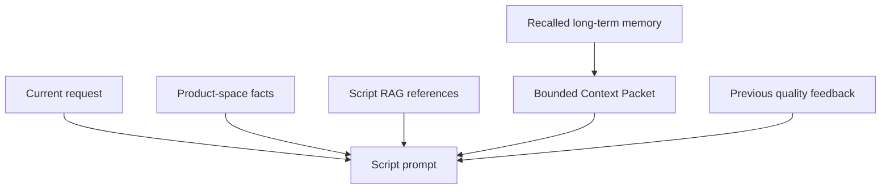

<p align="center">
  
</p>

<h1 align="center">VidForge</h1>

<p align="center"><strong>知識に基づく動画生成のためのオープンソース Multi-Agent 基盤。</strong><br />
素材理解、ブランド知識、コンテキスト設計、脚本計画、動画生成、品質評価、メディア合成を可観測なパイプラインに統合します。</p>

<p align="center">
  <a href="./README.md">English</a> · <a href="./README.zh-CN.md">简体中文</a> · <a href="./README.ja.md">日本語</a> · <a href="./README.fr.md">Français</a> · <a href="./README.de.md">Deutsch</a> · <a href="./README.ru.md">Русский</a>
</p>

<p align="center">
  <a href="https://github.com/WANGLEVY9/VidForge/actions/workflows/ci.yml"></a>
  <a href="https://github.com/WANGLEVY9/VidForge/actions/workflows/codeql.yml"></a>
  <a href="https://github.com/WANGLEVY9/VidForge/actions/workflows/secret-scan.yml"></a>
  <a href="./LICENSE"></a>
  
</p>

<p align="center"><a href="https://vid-forge-frontend-nu.vercel.app/">デモ</a> · <a href="./docs/AGENT_RUNTIME.md">Agent ランタイム</a> · <a href="./docs/TECHNICAL_ARCHITECTURE.md">アーキテクチャ</a> · <a href="./ROADMAP.md">ロードマップ</a></p>

> **ステータス：開発中。** VidForge は有料モデルの認証情報なしでもビルド、テスト、探索できます。実際のテキスト、画像、動画、TTS 生成には対応する Provider が必要です。公開デモは独立デプロイであり、すべての Provider が有効とは限りません。

## VidForge とは

VidForge はコマースとプロダクトストーリー向けのセルフホスト可能な AI 動画制作ワークスペースです。動画生成を単一のモデル呼び出しとして扱わず、素材検索、制限付きコンテキストの構築、ストーリーボード計画、Provider 呼び出し、品質評価、次の試行へのフィードバックを状態付きワークフローとして実行します。

| 領域                             | 実装                                                                            |
| -------------------------------- | ------------------------------------------------------------------------------- |
| Multi-Agent オーケストレーション | 明示的な LangGraph state、専門ノード、条件付き再計画、有限リトライ、キャンセル  |
| 知識に基づく生成                 | Script RAG、商品スペース知識、素材検索、出典付き参照                            |
| コンテキスト設計                 | スコープ付き長期メモリ、検索スコア、Prompt 予算、サニタイズ、品質フィードバック |
| 実行可能な動画パイプライン       | 並列ショット生成、FFmpeg、TTS、BGM、字幕、ストレージ、進捗通知                  |

## Multi-Agent ワークフロー

```text
START → orchestrator → material_analysis → script_generation
                                      ↓                    ↓
                              quality_control ← video_composition
                                      │
                                      └── 有限の品質再計画 → script_generation
```

| Agent             | 役割                                                       | 出力                              |
| ----------------- | ---------------------------------------------------------- | --------------------------------- |
| Material Agent    | ユーザーと商品スペース内の画像を検索し、決定論的に順位付け | 最大 5 件の素材候補               |
| Script Agent      | リクエスト、素材、RAG、メモリ、前回の品質結果を統合        | Hook / Demo / CTA の 3 ショット案 |
| Composition Agent | 制限された並列バッチで生成し、Provider タスクをポーリング  | ショット結果とメディア URL        |
| Quality Agent     | 完全性、長さ、一貫性、コンプライアンス、Hook を評価        | 5 軸スコアと再計画フィードバック  |

制御不能な Agent swarm ではなく、明示的なグラフを使います。Provider や一時的なネットワーク障害には指数バックオフ付きの有限リトライを使い、キャンセル、入力エラー、HTTP 4xx はリトライしません。品質再計画は `AGENT_QC_MAX_RETRIES` で別に制限されます。

## システムアーキテクチャ



グラフ状態はリクエスト、検索メモリ、素材解析、脚本、RAG の証拠、合成結果、品質軸、エラー、trace 概要を保持します。PostgreSQL は実行 control plane と最終状態を永続化します。`PostgresSaver` は LangGraph の super-step checkpoint を保存し、独立した Agent Worker は期限切れ lease を回収して同じ thread を未完了 node から再開します。これは node 境界の復旧であり、event-sourced workflow engine や第三者 Provider の exactly-once を意味しません。

### 制御と失敗の扱い

- Provider、データベース、一時的なネットワーク障害は指数バックオフと jitter 付きの有限リトライを使います。
- キャンセル、構文/型エラー、HTTP 4xx の入力エラーはリトライしません。
- `agent_runs` は queued/running/terminal の状態、進捗、入力、結果を保存します。
- 起動時に中断された `running` タスクを failed とし、自動再実行による重複課金を避けます。
- `AbortController` がキャンセルを現在のグラフ実行へ伝播します。

## コンテキストエンジニアリング



Context Packet は無制限の会話を Prompt に連結しません。弱い結果を除外し、score と ID で安定ソートし、件数と文字数を制限し、制御文字を削除してマークアップをエスケープします。メモリ ID、kind、score、provenance を保持し、参照データをモデル命令として扱わないよう明示します。

```dotenv
AGENT_MAX_RETRIES=3
AGENT_RETRY_BASE_DELAY_MS=2000
AGENT_QC_MAX_RETRIES=2
AGENT_MEMORY_TOP_K=6
AGENT_MEMORY_MAX_CHARS=1800
```

## 知識、RAG、コンテキスト、メモリ

三つの知識プレーンを分離しています。

- **商品スペース知識**：セールスポイント、対象、ブランドトーン、価格帯、禁止語、最大 5 件の高品質脚本パターン。スコア 85 以上で fallback ではない実行だけがベストプラクティスを冪等に保存します。
- **Script RAG コーパス**：7 つのコマースカテゴリにまたがる 9 件の構造化シード。Hook 種別、Hook / Demo / CTA 骨格、メッセージ例、BGM 方針、参照メタデータを含みます。
- **素材検索**：ユーザー/商品スペース分離、タグ、解析メタデータ、キャプション、任意の 1024 次元 pgvector embedding を保持します。現在の Agent は SQL と決定論的ヒューリスティックを使い、意味検索 API は embedding Provider の拡張点です。

Script RAG はカテゴリとスタイルの一致を使う再現可能な検索で、既定では上位 2 件を Prompt に渡し、`ragReferences` にシード ID と Hook メタデータを残します。内蔵コーパスは開発用ベースラインであり、実運用の成果やコンバージョン率を示すものではありません。

長期メモリは `agent_memories` に保存され、`user`、`product_space`、`run` のスコープと、`preference`、`fact`、`success_pattern`、`failure_pattern`、`decision` の種別を持ちます。初期検索スコアは次の通りです。

```text
score = lexical_match × 0.65 + importance × 0.25 + recency × 0.10
```

Context Packet は弱い結果を除外し、件数と文字数を制限し、制御文字を除去し、メモリを命令ではなく参照データとして提示します。メモリ障害は fail-soft で処理され、動画生成を停止させません。

## 品質ループとメディア処理

Quality Agent は完全性 30%、長さ 15%、一貫性 20%、コンプライアンス 20%、Hook 15% で評価します。合計 70 以上かつ違反がなければ成功し、それ以外は Script Agent に構造化フィードバックを返します。

Composition Agent は最大 3 ショットの並列生成、8 分間のポーリング、FFmpeg による正規化と連結、TTS または無音 fallback、BGM、SRT 字幕、ローカル/OSS への公開を実行します。出力には長さ、サイズ、SHA-256、メディア特徴が含まれます。Provider が未設定の場合、placeholder を完成品として扱わず、能力不足を明示します。

Quality Agent の重みは完全性 30%、長さ 15%、一貫性 20%、コンプライアンス 20%、Hook 15% です。加重 score が 70 以上で違反がなければ成功し、それ以外は構造化された問題を Script Agent に返します。

## Provider 契約

外部機能は SDK の request shape ではなく、業務レベルの TypeScript 契約の背後に置かれます。

| Capability       | Contract                  | Current adapter                       |
| ---------------- | ------------------------- | ------------------------------------- |
| Text generation  | `TextGenerationProvider`  | ARK text                              |
| Video generation | `VideoGenerationProvider` | ARK video                             |
| Text to speech   | `TextToSpeechProvider`    | Volcano/OpenSpeech + silence fallback |
| Object storage   | `ObjectStorageProvider`   | Aliyun OSS + local fallback           |
| Media processing | `MediaProcessingProvider` | FFmpeg                                |

新しい adapter は business contract を実装し、capability と trace metadata を維持してください。Vendor 固有型を Agent に漏らさないことがコミュニティ拡張の基本ルールです。

## Provider、キュー、観測性

テキスト、動画、TTS、オブジェクトストレージ、メディア処理は業務レベルの TypeScript 契約で分離されています。現在のアダプターは ARK、Volcano/OpenSpeech TTS、Aliyun OSS、FFmpeg です。

- BullMQ はショット生成、合成、エクスポート、素材解析を扱います。Redis が利用できないローカル環境ではプロセス内 fallback を使えます。
- `trace_spans` はタスク、スコープ、遅延、状態、モデル、Token、推定コスト、キャッシュヒット、メタデータを記録します。
- Agent はリトライ、trace span、メモリヒット、最大メモリスコア、RAG 参照数も記録します。

Queue job は attempts、priority、delay、idempotent job ID をサポートします。trace write と OTLP export は fail-soft であり、観測性の障害が creative workflow を壊さないようにしています。

## 実装状況とロードマップ

実装済み：フロントエンドワークスペース、認証、商品スペース、素材、脚本、タスク、Multi-Agent グラフ、品質再計画、基礎 RAG、スコープ付きメモリ、FFmpeg 合成、PostgreSQL checkpoint と node 復旧、独立 Agent Worker、Provider operation ledger、任意の Redis/BullMQ 経路。

実装済み：オプトイン HITL の `interrupt()`/resume、redacted checkpoint inspection、分離 thread による replay/fork、Agent transactional outbox、Agent/Media Worker の役割分離。今後の課題は workflow versioning、creation/composition/export の業務実装、動的 subagent router、権限付き skills/tools、hybrid RAG と reranker、Agent trajectory 評価データセットです。

設計の参考：[LangGraph.js](https://github.com/langchain-ai/langgraphjs)、[DeerFlow](https://github.com/bytedance/deer-flow)、[Letta](https://github.com/letta-ai/letta)、[Claude Code subagents](https://code.claude.com/docs/en/sub-agents)。機能同等やコード再利用を意味しません。

### Capability matrix

| Capability                                         | Status                       | External requirement                                  |
| -------------------------------------------------- | ---------------------------- | ----------------------------------------------------- |
| Frontend studio and browser-only `/try`            | Implemented                  | None for `/try`                                       |
| Auth, product spaces, materials, scripts and tasks | Implemented                  | PostgreSQL                                            |
| Multi-Agent graph and quality replan               | Implemented                  | Text/video Provider for real output                   |
| Script RAG and reference propagation               | Implemented baseline         | None for seed retrieval                               |
| Scoped memory and Context Packet                   | Implemented lexical baseline | PostgreSQL                                            |
| Material semantic search                           | Optional implemented path    | pgvector + embedding endpoint                         |
| FFmpeg composition                                 | Implemented                  | Local FFmpeg                                          |
| Durable queue and cross-process cache              | Optional implemented path    | Redis                                                 |
| PostgreSQL checkpoint and node-level resume        | Implemented                  | PostgreSQL + dedicated Agent Worker                   |
| Provider operation ledger and owner audit          | Implemented                  | PostgreSQL; Provider idempotency is adapter-dependent |
| Human approval / interrupt-resume                  | Implemented (opt-in)         | Checkpoint persistence; review UI via API             |
| Agent outbox and isolated replay/fork              | Implemented                  | PostgreSQL + Redis                                    |
| Dynamic router, skills and tool registry           | Roadmap                      | Runtime and permission model                          |
| Hybrid RAG, reranker and evaluation dataset        | Roadmap                      | Corpus and evaluation work                            |

### Agent engineering roadmap

- **Durable execution and human oversight**：`interrupt()` 承認 node、redacted inspection、replay/fork、Agent outbox は実装済みです。workflow versioning は今後の課題です。
- **Context engineering**：query planning、context compression、evidence gating、ノードごとの Token budget。
- **Hierarchical Multi-Agent**：型付き specialist router、delegation budget、分離された state slice。
- **Memory lifecycle**：consolidation、矛盾処理、decay、run memory から product knowledge への昇格。
- **Skills and tools**：発見可能で権限管理された能力を Prompt から分離。
- **Agent evaluation**：trajectory、RAG evidence、memory usefulness、コスト、最終メディア品質を個別評価。

## クイックスタート

必要なもの：Node.js 20、pnpm `8.15.4`、Docker Compose、FFmpeg 4 以上。

```bash
git clone https://github.com/WANGLEVY9/VidForge.git
cd VidForge
corepack enable
corepack prepare pnpm@8.15.4 --activate
pnpm install --frozen-lockfile
docker compose up -d
cp apps/backend/.env.example apps/backend/.env
cp apps/frontend/.env.example apps/frontend/.env.local
pnpm --filter @vidforge/backend migration:run
pnpm check:env
pnpm dev
```

フロントエンドは `http://localhost:3000`、体験フローは `/try`、ワークスペースは `/workspace`、API は `http://localhost:3001/api`、Swagger は `/api/docs` です。実際の生成には Provider の資格情報が必要です。検証には `pnpm docs:check`、`pnpm test`、`pnpm lint`、`pnpm build`、`pnpm verify` を使えます。

### 設定

| Variable                            | Required         | Purpose                                 |
| ----------------------------------- | ---------------- | --------------------------------------- |
| `DATABASE_URL`                      | Yes              | PostgreSQL 接続                         |
| `JWT_SECRET`                        | Production       | 本番では 32 文字以上                    |
| `WEB_BASE_URL`                      | Production       | HTTP / WebSocket CORS allowlist         |
| `API_BASE_URL`                      | Production       | 公開メディアと export URL               |
| `ARK_TEXT_PRIMARY_*`                | Optional         | 実際の text / quality model 呼び出し    |
| `ARK_VIDEO_PRIMARY_*`               | Optional         | 実際の shot 生成                        |
| `EMBEDDING_API_URL`                 | Optional         | 素材 embedding、既定は local Ollama     |
| `REDIS_URL`                         | Optional locally | BullMQ と cross-process cache           |
| `VOLC_TTS_APPID` / `VOLC_TTS_TOKEN` | Optional         | 実 TTS、未設定時は無音 fallback         |
| `OSS_*`                             | Optional         | ローカル disk の代わりの object storage |
| `OTEL_EXPORTER_OTLP_*`              | Optional         | OTLP/HTTP trace collector               |
| `VITE_API_BASE_URL`                 | Frontend         | ブラウザから見える backend origin       |
| `VITE_WS_URL`                       | Optional         | WebSocket origin override               |

`VITE_*` に secret を置かないでください。Vite は値をブラウザ asset に埋め込みます。

| Surface              | Local URL                                                                                                                   |
| -------------------- | --------------------------------------------------------------------------------------------------------------------------- |
| Landing page         | [`http://localhost:3000`](http://localhost:3000)                                                                            |
| Browser-only flow    | [`http://localhost:3000/try`](http://localhost:3000/try)                                                                    |
| Workspace            | [`http://localhost:3000/workspace`](http://localhost:3000/workspace)                                                        |
| REST API             | [`http://localhost:3001/api`](http://localhost:3001/api)                                                                    |
| Swagger              | [`http://localhost:3001/api/docs`](http://localhost:3001/api/docs)                                                          |
| Liveness / readiness | [`http://localhost:3001/api/health`](http://localhost:3001/api/health) / [`/ready`](http://localhost:3001/api/health/ready) |

## API とコントリビューション

主要 API は `POST /api/agent/run`、`GET /api/agent/status/:taskId`、`GET /api/agent/runs/:taskId/audit`、`POST /api/agent/cancel/:taskId`、`GET /api/agent/memory`、`GET /api/spaces`、`PATCH /api/material/:id/analyze` です。Swagger がリクエストとレスポンスの正規リファレンスです。

Provider アダプター、RAG 評価、メモリ統合、checkpoint、人間承認、動画品質、字幕・音声、アクセシビリティ、デプロイ信頼性の貢献を歓迎します。まず [`CONTRIBUTING.md`](./CONTRIBUTING.md)、[`docs/CONTRIBUTOR_QUICKSTART.md`](./docs/CONTRIBUTOR_QUICKSTART.md)、[`GOVERNANCE.md`](./GOVERNANCE.md) をお読みください。

## Repository map

```text
apps/frontend/src/              # React/Vite studio, pages, components, store, clients
apps/backend/src/modules/agent/ # graph, agents, runs, memory, Context Packet
apps/backend/src/modules/rag/   # structured Script RAG seed corpus
apps/backend/src/modules/media/ # FFmpeg, TTS, BGM, subtitles, storage
apps/backend/src/providers/     # provider contracts and adapters
docs/                           # architecture, runtime, deployment, observability
examples/                       # credential-free request fixtures
scripts/                        # repository and documentation checks
```

## 検証とドキュメント

```bash
pnpm docs:check
pnpm check:hygiene
pnpm test:repo
pnpm test:backend
pnpm lint
pnpm stylelint
pnpm build
pnpm verify
```

CI は unit、contract、migration、security-policy、FFmpeg smoke、Markdown links、dependency risk、lint、style、build、bundle budget を確認します。

| Document                                                             | Focus                                          |
| -------------------------------------------------------------------- | ---------------------------------------------- |
| [`docs/AGENT_RUNTIME.md`](./docs/AGENT_RUNTIME.md)                   | graph lifecycle、retry、memory、context budget |
| [`docs/TECHNICAL_ARCHITECTURE.md`](./docs/TECHNICAL_ARCHITECTURE.md) | 境界と技術判断                                 |
| [`docs/OBSERVABILITY.md`](./docs/OBSERVABILITY.md)                   | trace、cost、latency、OTLP                     |
| [`docs/PROVIDER_CONTRACTS.md`](./docs/PROVIDER_CONTRACTS.md)         | Provider replacement contracts                 |
| [`ROADMAP.md`](./ROADMAP.md)                                         | 今後の方向性                                   |
| [`CHANGELOG.md`](./CHANGELOG.md)                                     | version history                                |

API Key、JWT Secret、データベース認証情報、ユーザーデータをコミットしないでください。VidForge は [MIT License](./LICENSE) で提供され、本文書で参照する企業・プロジェクトとは独立しています。

詳細な技術説明は [`README.md`](./README.md) を参照してください。
