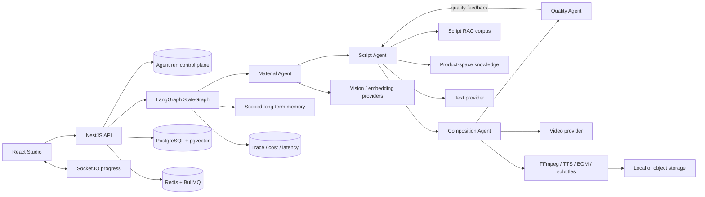
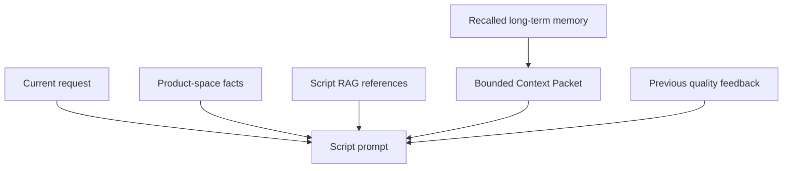

<p align="center">
  
</p>

<h1 align="center">VidForge</h1>

<p align="center"><strong>Открытая Multi-Agent инфраструктура для генерации видео на основе знаний.</strong><br />
VidForge объединяет понимание материалов, знания о бренде, управление контекстом, планирование сценария, генерацию видео, контроль качества и сборку медиа в наблюдаемый конвейер.</p>

<p align="center">
  <a href="./README.md">English</a> · <a href="./README.zh-CN.md">简体中文</a> · <a href="./README.ja.md">日本語</a> · <a href="./README.fr.md">Français</a> · <a href="./README.de.md">Deutsch</a> · <a href="./README.ru.md">Русский</a>
</p>

<p align="center">
  <a href="https://github.com/WANGLEVY9/VidForge/actions/workflows/ci.yml"></a>
  <a href="https://github.com/WANGLEVY9/VidForge/actions/workflows/codeql.yml"></a>
  <a href="https://github.com/WANGLEVY9/VidForge/actions/workflows/secret-scan.yml"></a>
  <a href="./LICENSE"></a>
  
</p>

<p align="center"><a href="https://vid-forge-frontend-nu.vercel.app/">Демо</a> · <a href="./docs/AGENT_RUNTIME.md">Runtime Agent</a> · <a href="./docs/TECHNICAL_ARCHITECTURE.md">Архитектура</a> · <a href="./ROADMAP.md">План развития</a></p>

> **Статус: активная разработка.** VidForge можно собирать и тестировать без платных ключей моделей. Для настоящей генерации текста, изображений, видео и речи нужны соответствующие Provider. Публичная демо-версия развёрнута отдельно и может не включать все Provider.

## Что такое VidForge?

VidForge — это self-hosted рабочее пространство для создания AI-видео в коммерческом и продуктово-ориентированном контексте. Запрос не превращается в один вызов модели: специализированные Agents ищут материалы, формируют ограниченный контекст, планируют раскадровку, вызывают медиа-провайдеров, оценивают результат и передают данные о качестве следующей попытке.

| Область                    | Реализация                                                                                                   |
| -------------------------- | ------------------------------------------------------------------------------------------------------------ |
| Multi-Agent оркестрация    | Явное состояние LangGraph, специализированные узлы, условное перепланирование, ограниченные повторы и отмена |
| Генерация на основе знаний | Script RAG, знания продуктового пространства, поиск материалов и ссылки с provenance                         |
| Управление контекстом      | Долговременная память по scope, оценки поиска, бюджеты Prompt, очистка и feedback                            |
| Исполняемый видеоконвейер  | Параллельная генерация сцен, FFmpeg, TTS, музыка, субтитры, storage и прогресс                               |

## Multi-Agent runtime

```text
START → orchestrator → material_analysis → script_generation
                                      ↓                    ↓
                              quality_control ← video_composition
                                      │
                                      └── ограниченное перепланирование → script_generation
```

| Agent             | Ответственность                                                                    | Результат                                   |
| ----------------- | ---------------------------------------------------------------------------------- | ------------------------------------------- |
| Material Agent    | Ищет изображения в области пользователя/продукта и сортирует их детерминированно   | До пяти кандидатов материалов               |
| Script Agent      | Объединяет запрос, материалы, RAG, память и прошлый feedback                       | Трёхсценный план Hook / Demo / CTA          |
| Composition Agent | Генерирует сцены ограниченными параллельными пакетами и опрашивает Provider-задачи | Результаты сцен и финальный media URL       |
| Quality Agent     | Проверяет полноту, длительность, согласованность, compliance и Hook                | Пять оценок и feedback для перепланирования |

Используется явный граф, а не неконтролируемый Agent swarm. Ошибки Provider и временные сетевые ошибки получают ограниченные повторы с exponential backoff и jitter. Отмена, ошибки входных данных и HTTP 4xx не повторяются; перепланирование качества отдельно ограничивается `AGENT_QC_MAX_RETRIES`.

## Системная архитектура



Состояние графа содержит запрос, найденную память, анализ материалов, план сценария, RAG-доказательства, результат композиции, измерения качества, ошибки и сводки trace. PostgreSQL хранит control plane запуска и финальное состояние. `PostgresSaver` сохраняет super-step checkpoint LangGraph; отдельный Agent Worker забирает просроченный lease и продолжает тот же thread с последнего незавершённого узла. Это восстановление на границе узла, а не event-sourced workflow engine и не гарантия exactly-once для сторонних Provider.

### Управление и семантика ошибок

- Ошибки Provider, базы данных и временной сети получают ограниченные повторы с exponential backoff и jitter.
- Отмена, синтаксические/типовые ошибки и HTTP 4xx не повторяются.
- `agent_runs` сохраняет состояния queued/running/terminal, прогресс, вход и результат.
- Прерванные `running` задачи при старте помечаются failed, чтобы не создавать повторные расходы Provider.
- `AbortController` передаёт отмену активному запуску графа.

## Инженерия контекста



Context Packet отбрасывает слабые результаты, детерминированно сортирует их по score и ID, ограничивает число и размер текста, удаляет управляющие символы и экранирует чувствительный markup. ID, kind, score и provenance сохраняются; память обозначается как справочные данные, а не как инструкция модели.

```dotenv
AGENT_MAX_RETRIES=3
AGENT_RETRY_BASE_DELAY_MS=2000
AGENT_QC_MAX_RETRIES=2
AGENT_MEMORY_TOP_K=6
AGENT_MEMORY_MAX_CHARS=1800
```

## Знания, RAG, контекст и память

Три плана знаний разделены по владению и жизненному циклу:

- **Продуктовое пространство**: преимущества, аудитория, тон бренда, ценовое позиционирование, запрещённые слова и до пяти качественных шаблонов сценариев. Только non-fallback запуск со score не ниже 85 идемпотентно сохраняется как best practice.
- **Script RAG corpus**: 9 структурированных seed-записей в 7 коммерческих категориях. Каждая содержит тип Hook, каркас Hook / Demo / CTA, примеры сообщений, направление музыки и метаданные происхождения.
- **Поиск материалов**: изоляция пользователя и продуктового пространства, теги, метаданные анализа, подписи и опциональный pgvector embedding размерности 1024. Текущий Agent сочетает SQL и детерминированные эвристики; semantic API оставляет точку расширения для embedding Provider.

Поиск Script RAG воспроизводим: точное совпадение категории имеет наибольший вес, совпадение стиля — вторичный, частичное совпадение — небольшой бонус. В Prompt передаются две лучшие seed-записи, а их ID и Hook-метаданные сохраняются в `ragReferences`. Встроенный corpus — база разработки, а не benchmark конверсии.

Долговременная память `agent_memories` поддерживает scope `user`, `product_space`, `run` и типы `preference`, `fact`, `success_pattern`, `failure_pattern`, `decision`.

```text
score = lexical_match × 0.65 + importance × 0.25 + recency × 0.10
```

Context Packet отбрасывает слабые результаты, ограничивает количество и размер текста, удаляет управляющие символы и показывает память как справочные данные, а не как инструкции. Ошибки памяти обрабатываются fail-soft и не останавливают генерацию видео.

## Контур качества и медиаконвейер

Quality Agent использует веса: полнота 30 %, длительность 15 %, согласованность 20 %, compliance 20 %, сила Hook 15 %. Результат проходит при score не ниже 70 и отсутствии compliance-нарушений; иначе структурированная обратная связь возвращается Script Agent для ограниченного перепланирования.

Composition Agent параллельно создаёт до трёх сцен, опрашивает задачи до восьми минут, нормализует и объединяет фрагменты через FFmpeg, создаёт голос или silence fallback, смешивает музыку, формирует SRT-субтитры и публикует результат в local storage или OSS. Результат содержит длительность, размер, SHA-256 и признаки медиа. При отсутствии video Provider система сообщает о недостающей возможности и не выдаёт placeholder за готовое видео.

Quality Agent использует веса: полнота 30 %, длительность 15 %, согласованность 20 %, compliance 20 %, сила Hook 15 %. Запуск успешен при score не ниже 70 и отсутствии compliance-нарушений.

## Контракты Provider

Внешние возможности изолированы бизнес-контрактами TypeScript, а не формами запросов конкретных SDK.

| Возможность      | Контракт                  | Текущий адаптер                       |
| ---------------- | ------------------------- | ------------------------------------- |
| Генерация текста | `TextGenerationProvider`  | ARK text                              |
| Генерация видео  | `VideoGenerationProvider` | ARK video                             |
| Синтез речи      | `TextToSpeechProvider`    | Volcano/OpenSpeech + silence fallback |
| Object storage   | `ObjectStorageProvider`   | Aliyun OSS + local fallback           |
| Обработка медиа  | `MediaProcessingProvider` | FFmpeg                                |

Новый адаптер должен соблюдать business contract, раскрывать capability и сохранять trace metadata, не протекая vendor-specific типами в Agents.

## Provider, очереди и наблюдаемость

Текст, видео, TTS, object storage и media processing изолированы бизнес-контрактами TypeScript. Текущие адаптеры: ARK, Volcano/OpenSpeech TTS, Aliyun OSS и FFmpeg. BullMQ покрывает генерацию сцен, композицию, экспорт и анализ материалов; при недоступном Redis в локальной разработке возможен process-local fallback.

`trace_spans` сохраняет задачу, scope, задержку, статус, модель, Token, оценочную стоимость, cache hit и метаданные. Agent workflow дополнительно записывает повторы, число trace span, попадания памяти, максимальный memory score и RAG-ссылки. Ошибки записи trace не ломают основной workflow.

Queue jobs поддерживают attempts, priorities, delays и idempotent job IDs. Ответы ARK используют Redis как cross-process cache и in-memory LRU fallback; запись trace и OTLP export не должны останавливать creative workflow.

## Реализовано и план развития

Реализовано: frontend workspace, аутентификация, продуктовые пространства, материалы, сценарии, задачи, Multi-Agent graph, перепланирование качества, базовый RAG, memory по scope, FFmpeg-композиция, PostgreSQL checkpoint с node-level recovery, отдельный Agent Worker, Provider-operation ledger и опциональные Redis/BullMQ пути.

Уже реализованы: опциональный HITL через `interrupt()`/resume, redacted inspection checkpoint, replay/fork в изолированных threads, transactional Agent outbox и разделение ролей Agent/Media Worker. В плане остаются versioning workflow, полноценная бизнес-реализация Workers для creation/composition/export, динамический subagent router, управляемый реестр skills/tools, hybrid RAG с reranker и evaluation dataset для Agent trajectories.

Архитектурные ориентиры: [LangGraph.js](https://github.com/langchain-ai/langgraphjs), [DeerFlow](https://github.com/bytedance/deer-flow), [Letta](https://github.com/letta-ai/letta), [Claude Code subagents](https://code.claude.com/docs/en/sub-agents). Это не означает функционального равенства или повторного использования кода.

### Матрица возможностей

| Возможность                                        | Статус                          | Внешнее требование                              |
| -------------------------------------------------- | ------------------------------- | ----------------------------------------------- |
| Frontend studio и browser-only `/try`              | Реализовано                     | Для `/try` ничего дополнительного               |
| Auth, product spaces, материалы, сценарии и задачи | Реализовано                     | PostgreSQL                                      |
| Multi-Agent graph и перепланирование качества      | Реализовано                     | Text/video Provider для настоящего результата   |
| Script RAG и передача ссылок                       | Реализована базовая версия      | Для встроенных seed ничего дополнительного      |
| Scoped memory и Context Packet                     | Реализована лексическая база    | PostgreSQL                                      |
| Семантический поиск материалов                     | Опциональный реализованный путь | pgvector + embedding endpoint                   |
| FFmpeg-композиция                                  | Реализовано                     | Локальный FFmpeg                                |
| Durable queue и cross-process cache                | Опциональный реализованный путь | Redis                                           |
| PostgreSQL checkpoint и node-level recovery        | Реализовано                     | PostgreSQL + отдельный Agent Worker             |
| Provider-operation ledger и audit владельца        | Реализовано                     | PostgreSQL; идемпотентность зависит от адаптера |
| Human approval / interrupt-resume                  | Реализовано опционально         | Checkpoint persistence; review UI через API     |
| Agent outbox и изолированный replay/fork           | Реализовано                     | PostgreSQL + Redis                              |
| Dynamic router, skills и tool registry             | Roadmap                         | Runtime и permission model                      |
| Hybrid RAG, reranker и evaluation dataset          | Roadmap                         | Corpus и evaluation design                      |

### Roadmap Agent-системы

- **Durable execution и human oversight**: `interrupt()` approval nodes, redacted inspection, replay/fork и Agent outbox реализованы; versioning workflow остаётся открытой задачей.
- **Context engineering**: query planning, context compression, evidence gating и Token budget на узел.
- **Hierarchical Multi-Agent**: типизированный router, delegation budget и изолированные state slices.
- **Memory lifecycle**: consolidation, обработка противоречий, decay, promotion в product knowledge и retrieval metrics.
- **Skills и tools**: обнаруживаемые и разрешённые capabilities вместо действий, зашитых в Prompt.
- **Agent evaluation**: раздельная оценка trajectories, RAG evidence, memory usefulness, Provider cost и media quality.

## Быстрый старт

Требования: Node.js 20, pnpm `8.15.4`, Docker Compose, FFmpeg 4+.

```bash
git clone https://github.com/WANGLEVY9/VidForge.git
cd VidForge
corepack enable
corepack prepare pnpm@8.15.4 --activate
pnpm install --frozen-lockfile
docker compose up -d
cp apps/backend/.env.example apps/backend/.env
cp apps/frontend/.env.example apps/frontend/.env.local
pnpm --filter @vidforge/backend migration:run
pnpm check:env
pnpm dev
```

Frontend: `http://localhost:3000`, demo-flow `/try`, workspace `/workspace`, API `http://localhost:3001/api`, Swagger `/api/docs`. Для настоящей генерации нужны Provider credentials. Проверки: `pnpm docs:check`, `pnpm test`, `pnpm lint`, `pnpm build`, `pnpm verify`.

### Конфигурация и локальные поверхности

| Переменная                          | Требование           | Назначение                                  |
| ----------------------------------- | -------------------- | ------------------------------------------- |
| `DATABASE_URL`                      | Да                   | Подключение PostgreSQL                      |
| `JWT_SECRET`                        | Production           | В production не менее 32 символов           |
| `WEB_BASE_URL`                      | Production           | HTTP/WebSocket CORS allowlist               |
| `API_BASE_URL`                      | Production           | Префикс публичных media/export URL          |
| `ARK_TEXT_PRIMARY_*`                | Опционально          | Настоящие text и quality-model вызовы       |
| `ARK_VIDEO_PRIMARY_*`               | Опционально          | Реальная генерация сцен                     |
| `EMBEDDING_API_URL`                 | Опционально          | Media embeddings, по умолчанию local Ollama |
| `REDIS_URL`                         | Опционально локально | BullMQ и cross-process cache                |
| `VOLC_TTS_APPID` / `VOLC_TTS_TOKEN` | Опционально          | Реальный TTS вместо silence fallback        |
| `OSS_*`                             | Опционально          | Object storage вместо local disk            |
| `OTEL_EXPORTER_OTLP_*`              | Опционально          | OTLP/HTTP trace collector                   |
| `VITE_API_BASE_URL`                 | Frontend             | Backend origin, видимый браузеру            |
| `VITE_WS_URL`                       | Опционально          | WebSocket origin override                   |

Не размещайте secrets в `VITE_*`: Vite встраивает их в browser assets.

| Поверхность          | Локальный адрес                                                                                                   |
| -------------------- | ----------------------------------------------------------------------------------------------------------------- |
| Landing page         | [`http://localhost:3000`](http://localhost:3000)                                                                  |
| Guided flow          | [`http://localhost:3000/try`](http://localhost:3000/try)                                                          |
| Workspace            | [`http://localhost:3000/workspace`](http://localhost:3000/workspace)                                              |
| REST API             | [`http://localhost:3001/api`](http://localhost:3001/api)                                                          |
| Swagger              | [`http://localhost:3001/api/docs`](http://localhost:3001/api/docs)                                                |
| Liveness / readiness | [`/api/health`](http://localhost:3001/api/health) / [`/api/health/ready`](http://localhost:3001/api/health/ready) |

## API и участие

Основные endpoints: `POST /api/agent/run`, `GET /api/agent/status/:taskId`, `GET /api/agent/runs/:taskId/audit`, `POST /api/agent/cancel/:taskId`, `GET /api/agent/memory`, `GET /api/spaces`, `PATCH /api/material/:id/analyze`. Swagger является каноническим описанием запросов и ответов.

Будут полезны адаптеры Provider, оценка RAG, консолидация памяти, checkpoints, человеческое подтверждение, качество видео, субтитры, аудио, accessibility и надёжность деплоя. Начните с [`CONTRIBUTING.md`](./CONTRIBUTING.md), [`docs/CONTRIBUTOR_QUICKSTART.md`](./docs/CONTRIBUTOR_QUICKSTART.md) и [`GOVERNANCE.md`](./GOVERNANCE.md).

Не коммитьте API keys, JWT secrets, credentials базы данных и пользовательские данные. VidForge распространяется по [MIT License](./LICENSE) и независим от упомянутых проектов и компаний.

## Структура репозитория

```text
apps/frontend/src/              # React/Vite studio, страницы, компоненты, store, clients
apps/backend/src/modules/agent/ # graph, Agents, runs, memory, Context Packet
apps/backend/src/modules/rag/   # структурированный Script RAG corpus
apps/backend/src/modules/media/ # FFmpeg, TTS, музыка, субтитры, storage
apps/backend/src/providers/     # Provider contracts и adapters
docs/                           # architecture, runtime, deployment, observability
examples/                       # fixtures без credentials
scripts/                        # проверки репозитория и документации
```

## Проверка и документация

```bash
pnpm docs:check
pnpm check:hygiene
pnpm test:repo
pnpm test:backend
pnpm lint
pnpm stylelint
pnpm build
pnpm verify
```

CI проверяет unit, contract, migration, security-policy и FFmpeg smoke tests, Markdown links, dependencies, lint, styles, build и bundle budgets.

| Документ                                                             | Назначение                                         |
| -------------------------------------------------------------------- | -------------------------------------------------- |
| [`docs/AGENT_RUNTIME.md`](./docs/AGENT_RUNTIME.md)                   | graph lifecycle, retries, memory и context budgets |
| [`docs/TECHNICAL_ARCHITECTURE.md`](./docs/TECHNICAL_ARCHITECTURE.md) | границы системы и технические решения              |
| [`docs/OBSERVABILITY.md`](./docs/OBSERVABILITY.md)                   | trace, cost, latency и OTLP                        |
| [`docs/PROVIDER_CONTRACTS.md`](./docs/PROVIDER_CONTRACTS.md)         | Provider replacement contracts                     |
| [`ROADMAP.md`](./ROADMAP.md)                                         | направление проекта                                |
| [`CHANGELOG.md`](./CHANGELOG.md)                                     | история версий                                     |

Полная техническая версия находится в [`README.md`](./README.md).
