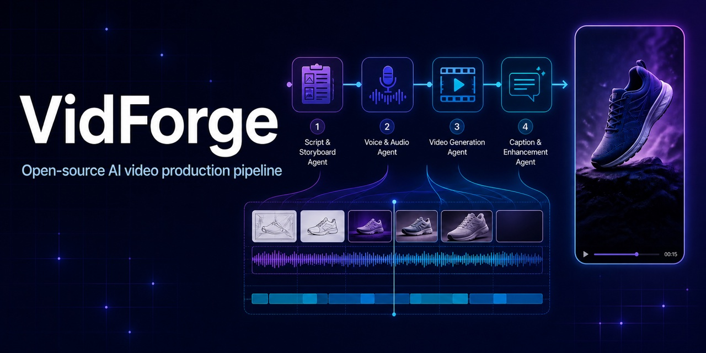

<p align="center">
  
</p>

<h1 align="center">VidForge</h1>

<p align="center"><strong>Открытая Multi-Agent инфраструктура для генерации видео на основе знаний.</strong><br />
VidForge объединяет понимание материалов, знания о бренде, управление контекстом, планирование сценария, генерацию видео, контроль качества и сборку медиа в наблюдаемый конвейер.</p>

<p align="center">
  <a href="./README.md">English</a> · <a href="./README.zh-CN.md">简体中文</a> · <a href="./README.ja.md">日本語</a> · <a href="./README.fr.md">Français</a> · <a href="./README.de.md">Deutsch</a> · <a href="./README.ru.md">Русский</a>
</p>

<p align="center">
  <a href="https://github.com/WANGLEVY9/VidForge/actions/workflows/ci.yml"></a>
  <a href="./LICENSE"></a>
  
</p>

<p align="center"><a href="https://vid-forge-frontend-nu.vercel.app/">Демо</a> · <a href="./docs/AGENT_RUNTIME.md">Runtime Agent</a> · <a href="./docs/TECHNICAL_ARCHITECTURE.md">Архитектура</a> · <a href="./ROADMAP.md">План развития</a></p>

> **Статус: активная разработка.** VidForge можно собирать и тестировать без платных ключей моделей. Для настоящей генерации текста, изображений, видео и речи нужны соответствующие Provider. Публичная демо-версия развёрнута отдельно и может не включать все Provider.

## Что такое VidForge?

VidForge — это self-hosted рабочее пространство для создания AI-видео в коммерческом и продуктово-ориентированном контексте. Запрос не превращается в один вызов модели: специализированные Agents ищут материалы, формируют ограниченный контекст, планируют раскадровку, вызывают медиа-провайдеров, оценивают результат и передают данные о качестве следующей попытке.

| Область                    | Реализация                                                                                                   |
| -------------------------- | ------------------------------------------------------------------------------------------------------------ |
| Multi-Agent оркестрация    | Явное состояние LangGraph, специализированные узлы, условное перепланирование, ограниченные повторы и отмена |
| Генерация на основе знаний | Script RAG, знания продуктового пространства, поиск материалов и ссылки с provenance                         |
| Управление контекстом      | Долговременная память по scope, оценки поиска, бюджеты Prompt, очистка и feedback                            |
| Исполняемый видеоконвейер  | Параллельная генерация сцен, FFmpeg, TTS, музыка, субтитры, storage и прогресс                               |

## Multi-Agent runtime

```text
START → orchestrator → material_analysis → script_generation
                                      ↓                    ↓
                              quality_control ← video_composition
                                      │
                                      └── ограниченное перепланирование → script_generation
```

| Agent             | Ответственность                                                                    | Результат                                   |
| ----------------- | ---------------------------------------------------------------------------------- | ------------------------------------------- |
| Material Agent    | Ищет изображения в области пользователя/продукта и сортирует их детерминированно   | До пяти кандидатов материалов               |
| Script Agent      | Объединяет запрос, материалы, RAG, память и прошлый feedback                       | Трёхсценный план Hook / Demo / CTA          |
| Composition Agent | Генерирует сцены ограниченными параллельными пакетами и опрашивает Provider-задачи | Результаты сцен и финальный media URL       |
| Quality Agent     | Проверяет полноту, длительность, согласованность, compliance и Hook                | Пять оценок и feedback для перепланирования |

Используется явный граф, а не неконтролируемый Agent swarm. Ошибки Provider и временные сетевые ошибки получают ограниченные повторы с exponential backoff и jitter. Отмена, ошибки входных данных и HTTP 4xx не повторяются; перепланирование качества отдельно ограничивается `AGENT_QC_MAX_RETRIES`.

## Знания, RAG, контекст и память

Три плана знаний разделены по владению и жизненному циклу:

- **Продуктовое пространство**: преимущества, аудитория, тон бренда, ценовое позиционирование, запрещённые слова и до пяти качественных шаблонов сценариев. Только non-fallback запуск со score не ниже 85 идемпотентно сохраняется как best practice.
- **Script RAG corpus**: 9 структурированных seed-записей в 7 коммерческих категориях. Каждая содержит тип Hook, каркас Hook / Demo / CTA, примеры сообщений, направление музыки и метаданные происхождения.
- **Поиск материалов**: изоляция пользователя и продуктового пространства, теги, метаданные анализа, подписи и опциональный pgvector embedding размерности 1024. Текущий Agent сочетает SQL и детерминированные эвристики; semantic API оставляет точку расширения для embedding Provider.

Поиск Script RAG воспроизводим: точное совпадение категории имеет наибольший вес, совпадение стиля — вторичный, частичное совпадение — небольшой бонус. В Prompt передаются две лучшие seed-записи, а их ID и Hook-метаданные сохраняются в `ragReferences`. Встроенный corpus — база разработки, а не benchmark конверсии.

Долговременная память `agent_memories` поддерживает scope `user`, `product_space`, `run` и типы `preference`, `fact`, `success_pattern`, `failure_pattern`, `decision`.

```text
score = lexical_match × 0.65 + importance × 0.25 + recency × 0.10
```

Context Packet отбрасывает слабые результаты, ограничивает количество и размер текста, удаляет управляющие символы и показывает память как справочные данные, а не как инструкции. Ошибки памяти обрабатываются fail-soft и не останавливают генерацию видео.

## Контур качества и медиаконвейер

Quality Agent использует веса: полнота 30 %, длительность 15 %, согласованность 20 %, compliance 20 %, сила Hook 15 %. Результат проходит при score не ниже 70 и отсутствии compliance-нарушений; иначе структурированная обратная связь возвращается Script Agent для ограниченного перепланирования.

Composition Agent параллельно создаёт до трёх сцен, опрашивает задачи до восьми минут, нормализует и объединяет фрагменты через FFmpeg, создаёт голос или silence fallback, смешивает музыку, формирует SRT-субтитры и публикует результат в local storage или OSS. Результат содержит длительность, размер, SHA-256 и признаки медиа. При отсутствии video Provider система сообщает о недостающей возможности и не выдаёт placeholder за готовое видео.

## Provider, очереди и наблюдаемость

Текст, видео, TTS, object storage и media processing изолированы бизнес-контрактами TypeScript. Текущие адаптеры: ARK, Volcano/OpenSpeech TTS, Aliyun OSS и FFmpeg. BullMQ покрывает генерацию сцен, композицию, экспорт и анализ материалов; при недоступном Redis в локальной разработке возможен process-local fallback.

`trace_spans` сохраняет задачу, scope, задержку, статус, модель, Token, оценочную стоимость, cache hit и метаданные. Agent workflow дополнительно записывает повторы, число trace span, попадания памяти, максимальный memory score и RAG-ссылки. Ошибки записи trace не ломают основной workflow.

## Реализовано и план развития

Реализовано: frontend workspace, аутентификация, продуктовые пространства, материалы, сценарии, задачи, Multi-Agent graph, перепланирование качества, базовый RAG, memory по scope, FFmpeg-композиция и опциональные Redis/BullMQ пути.

В плане: persistent LangGraph checkpoint, восстановление узлов после перезапуска Worker, человеческое подтверждение и interrupt-resume, динамический subagent router, управляемый реестр skills/tools, hybrid RAG с reranker и evaluation dataset для Agent trajectories.

Архитектурные ориентиры: [LangGraph.js](https://github.com/langchain-ai/langgraphjs), [DeerFlow](https://github.com/bytedance/deer-flow), [Letta](https://github.com/letta-ai/letta), [Claude Code subagents](https://code.claude.com/docs/en/sub-agents). Это не означает функционального равенства или повторного использования кода.

## Быстрый старт

Требования: Node.js 20, pnpm `8.15.4`, Docker Compose, FFmpeg 4+.

```bash
git clone https://github.com/WANGLEVY9/VidForge.git
cd VidForge
corepack enable
corepack prepare pnpm@8.15.4 --activate
pnpm install --frozen-lockfile
docker compose up -d
cp apps/backend/.env.example apps/backend/.env
cp apps/frontend/.env.example apps/frontend/.env.local
pnpm --filter @vidforge/backend migration:run
pnpm check:env
pnpm dev
```

Frontend: `http://localhost:3000`, demo-flow `/try`, workspace `/workspace`, API `http://localhost:3001/api`, Swagger `/api/docs`. Для настоящей генерации нужны Provider credentials. Проверки: `pnpm docs:check`, `pnpm test`, `pnpm lint`, `pnpm build`, `pnpm verify`.

## API и участие

Основные endpoints: `POST /api/agent/run`, `GET /api/agent/status/:taskId`, `POST /api/agent/cancel/:taskId`, `GET /api/agent/memory`, `GET /api/spaces`, `PATCH /api/material/:id/analyze`. Swagger является каноническим описанием запросов и ответов.

Будут полезны адаптеры Provider, оценка RAG, консолидация памяти, checkpoints, человеческое подтверждение, качество видео, субтитры, аудио, accessibility и надёжность деплоя. Начните с [`CONTRIBUTING.md`](./CONTRIBUTING.md), [`docs/CONTRIBUTOR_QUICKSTART.md`](./docs/CONTRIBUTOR_QUICKSTART.md) и [`GOVERNANCE.md`](./GOVERNANCE.md).

Не коммитьте API keys, JWT secrets, credentials базы данных и пользовательские данные. VidForge распространяется по [MIT License](./LICENSE) и независим от упомянутых проектов и компаний.

Полная техническая версия находится в [`README.md`](./README.md).
